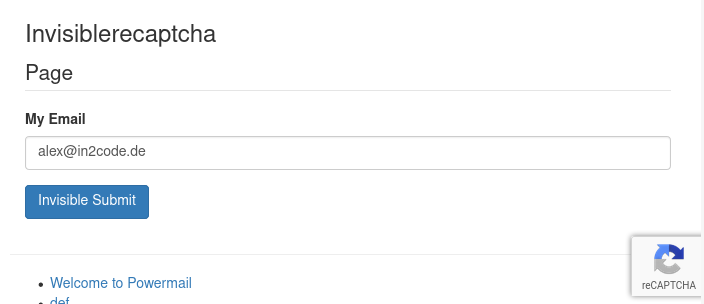

# invisiblerecaptcha

## Google invisible recaptcha for TYPO3 powermail to prevent spam




## Installation

- Just install this extension - e.g. `composer require in2code/invisiblerecaptcha`
- Register your domain to www.google.com/recaptcha/
- Add sitekey and secretkey to TypoScript Constants (see example below)
- Replace your submit button with the new field type "Google Invisible Recaptcha"
- Have fun

Example for TypoScript Constants:

```
plugin.tx_invisiblerecaptcha.sitekey = 6LdsBBUTAAAAAKMhI67inzeAvzBh5JdRRxlCwbTz
plugin.tx_invisiblerecaptcha.secretkey = 6LdsBBUTAAAAAKMhaaaainzeAvzBh5JdRRxlCwbyy
```

## Notes and best practice

Be sure to have spamshield enabled in powermail (TypoScript setup):


```
plugin.tx_powermail.settings.setup.spamshield._enable = 1
```

Keep up to date if powermail recognize spam (TypoScript setup):

```
# Get an email if spam was recognized
plugin.tx_powermail.settings.setup.spamshield.email = spamreceiver@yourdomain.org

# Write to a logfile when spam was recognized
plugin.tx_powermail.settings.setup.spamshield.logfileLocation = typo3temp/logs/powermailSpam.log
```


## Changelog

| Version    | Date       | Description                                                                                                  |
| ---------- | ---------- | ------------------------------------------------------------------------------------------------------------ |
| 5.1.1      | 2021-09-25 | Fix a typo in ter-release.yml file                                                                           |
| 5.1.0      | 2021-09-09 | Added auto deployment to TER, add extension key to composer.json file                                        |
| 5.0.0      | 2020-12-03 | Update for powermail 8.x                                                                                     |
| 4.0.0      | 2018-11-21 | Update for powermail 7.x, small bugfix in Template file                                                      |
| 3.0.0      | 2018-07-13 | Update for powermail 6.x                                                                                     |
| 2.0.0      | 2018-01-31 | Update for powermail 5.x                                                                                     |
| 1.1.1      | 2017-11-10 | Replace hardcoded button title in template                                                                   |
| 1.1.0      | 2017-11-04 | Update dependencies for powermail 4.x                                                                        |
| 1.0.0      | 2017-03-13 | Initial upload - have fun                                                                                    |
